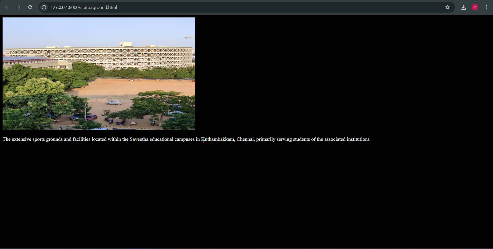
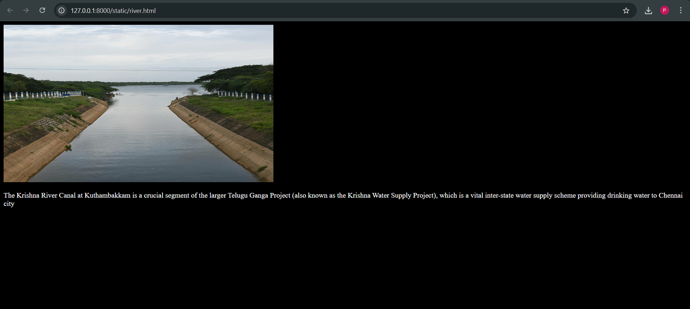

# Ex04 Places Around Me
## Date: 

## AIM
To develop a website to display details about the places around my house.

## DESIGN STEPS

### STEP 1
Create a Django admin interface.

### STEP 2
Download your city map from Google.

### STEP 3
Using ```<map>``` tag name the map.

### STEP 4
Create clickable regions in the image using ```<area>``` tag.

### STEP 5
Write HTML programs for all the regions identified.

### STEP 6
Execute the programs and publish them.

## CODE
```
<!DOCTYPE html>
<html lang="en">
<head>
    <meta charset="UTF-8">
    <meta name="viewport" content="width=device-width, initial-scale=1.0">
    <title>home page</title>
</head>
<body>
    <!-- Image Map Generated by http://www.image-map.net/ -->


<map name="image-map">
    <area target="" alt="saveetha university" title="saveetha university" href="simats.html" coords="928,685,634,571" shape="rect">
    <area target="" alt="saveetha ground" title="saveetha ground" href="ground.html" coords="344,103,122" shape="circle">
    <area target="" alt="krishna river" title="krishna river" href="river.html" coords="61,407,24,378,41,340,58,291,101,301,144,322,168,277,221,314,291,324,285,395,169,401,139,424,95,447" shape="poly">
</map>
</body>
</html>


<!DOCTYPE html>
<html lang="en">
<head>
    <meta charset="UTF-8">
    <meta name="viewport" content="width=device-width, initial-scale=1.0">
    <title>saveetha university</title>
</head>
<body bgcolor="black" text="white">
    
    <p>Saveetha Institute of Medical and Technical Sciences (SIMATS), often referred to as Saveetha University, is a prominent private deemed-to-be university located in Chennai, Tamil Nadu, known for its strong focus on research, innovation, and a wide array of professional courses. Established in 2005, it has gained national and global recognition for academic excellence, particularly in medical and dental education</p>
</body>
</html>

<!DOCTYPE html>
<html lang="en">
<head>
    <meta charset="UTF-8">
    <meta name="viewport" content="width=device-width, initial-scale=1.0">
    <title>krishna river</title>
</head>
<body bgcolor="black" text="white">
    
    <p>The Krishna River Canal at Kuthambakkam is a crucial segment of the larger Telugu Ganga Project (also known as the Krishna Water Supply Project), which is a vital inter-state water supply scheme providing drinking water to Chennai city</p>
</body>
</html>

<!DOCTYPE html>
<html lang="en">
<head>
    <meta charset="UTF-8">
    <meta name="viewport" content="width=device-width, initial-scale=1.0">
    <title>saveetha ground</title>
</head>
<body bgcolor="black" text="white">
    
    <p>The extensive sports grounds and facilities located within the Saveetha educational campuses in Kuthambakkam, Chennai, primarily serving students of the associated institutions </p>
</body>
</html>
```

## OUTPUT

 
 
## RESULT
The program for implementing image maps using HTML is executed successfully.
